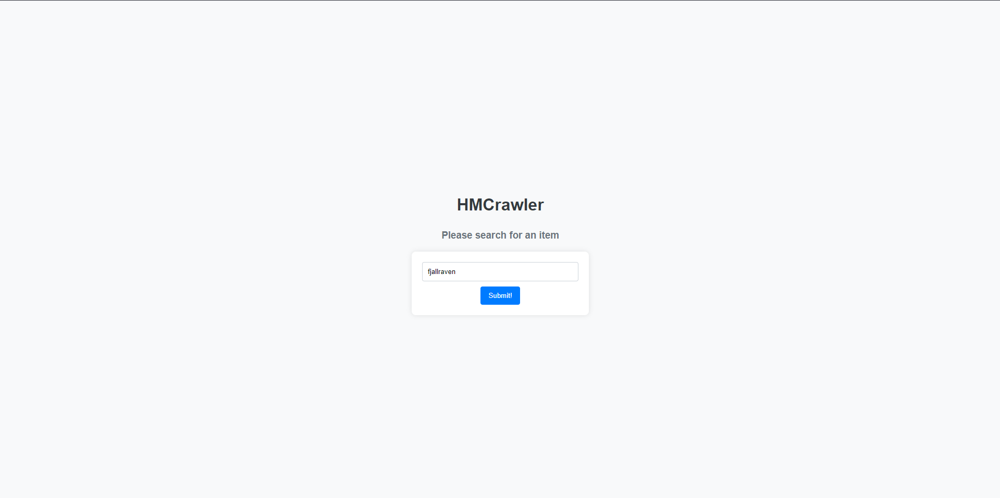
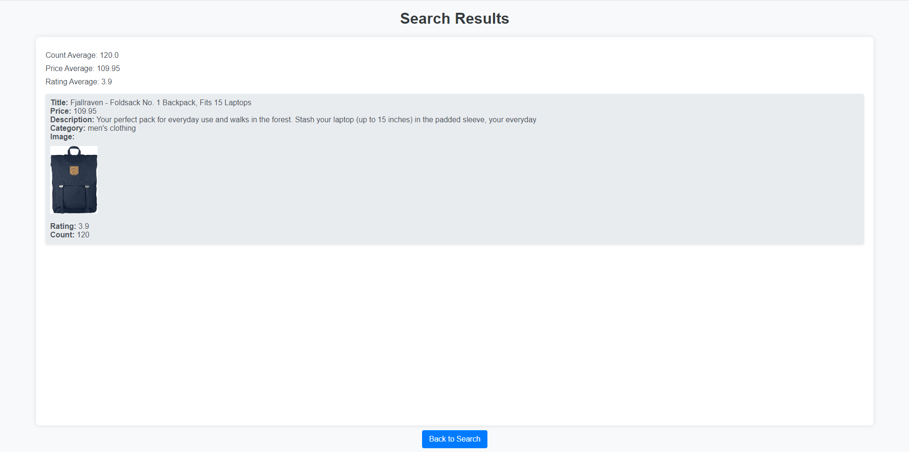

This is a web application that receives data from mock store data from [FakeStoreApi](https://fakestoreapi.com/) and allows a user to search for items and display them.

The web framework used is Flask and SQLAlchemy is used as an object relational mapper for a SQLite3 database.

The application can be reached through this [link](https://hmcrawler-ccb68113f3c4.herokuapp.com/) or by running it locally.

The application also contains the following features:

Unit & integration tests using mock objects, patching and test doubles

Production monitoring using ScoutAMP as a Heroku addon

Event collaboration messaging using CloudAMQP as a Heroku addon

Continuous integration using Github Actions

Continuous delivery using Heroku
